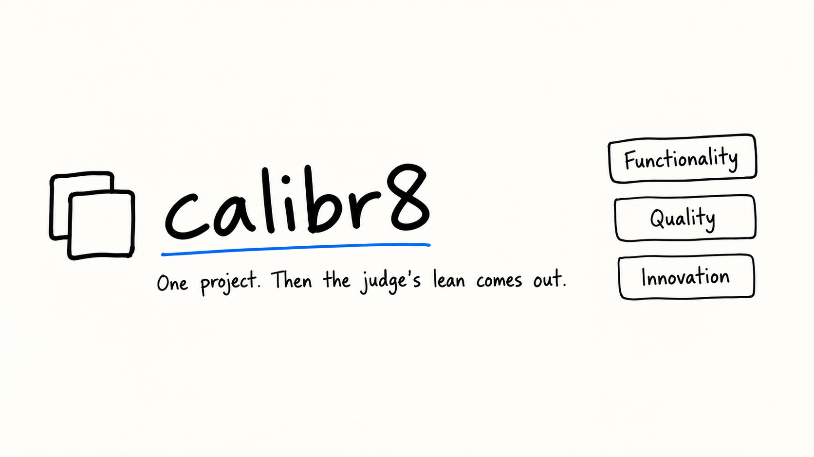
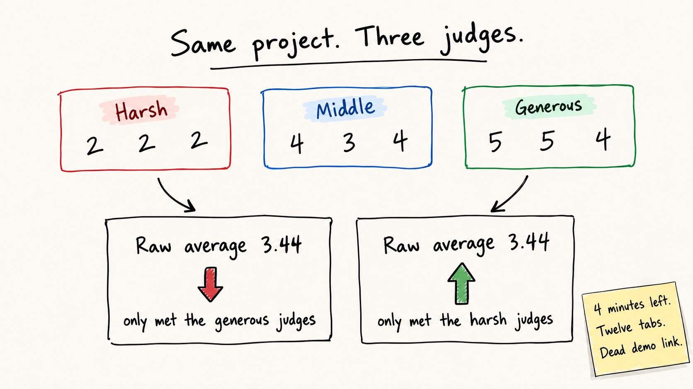

# calibr8



Offline hackathon judging. A judge sees one project, scores functionality, quality, and innovation, and scrolls to the next. The ranking treats each ballot as the project plus that judge's lean, then takes the lean back out.

The acceptance checker verifies T1 and T2 only. `.dogfood.toml` claims those two tiers and nothing else. The bonus board says to pick one. This repo has the four surfaces below. It does not claim the +16 for nailing all four.

## Run it

```bash
docker compose up --build
```

Open http://localhost:8080/signin. The password is the part before `@`, with dots written as hyphens.

| Who | Email | Password | What they do |
|---|---|---|---|
| Judge | `tomas.varga@example.org` | `tomas-varga` | Score one project at a time |
| Organizer | `organizer@example.org` | `organizer` | Open a hackathon and read standings |
| Participant | `participant@example.org` | `participant` | Read placement and the words on the ballot |

Wei Lindqvist is `wei.lindqvist@example.org` / `wei-lindqvist`. The participant email is not on a fixture team.

Checker cookies, if you are calling the API by hand:

- organizer `session=org_7f2a`
- judge A `session=jdg_a_91bc`
- judge B `session=jdg_b_44de`
- participant `session=prt_2e88`

Repeat the checks from this directory, with the container up:

```bash
python run.py .dogfood.toml
npm run calibrate:proof
```

`npm run calibrate:proof` is `python scripts/calibrate.py fixtures.json`. Python 3 only. No numpy.

A judge walkthrough that does not need Docker is at https://calibr-demo-sigma.vercel.app. Choose Judge. Ballots stay in that browser. `calibr-demo.vercel.app` is already taken by another account, so this copy does not use that host. That page is not the portal in this container.

## What the checker verifies

`acceptance-report.txt` is the output of `python run.py .dogfood.toml`. Seven checks, `claimed T1 T2, verified T1 T2`.

| Check | Request | Result |
|---|---|---|
| Gallery is public | `GET /projects` with no cookie | 200 |
| A fixture project is in that body | same response | a title from `fixtures.json` |
| Closed event refuses a submission | `POST /projects/new` as the participant | 4xx. The fixture closes `2026-03-01T18:00:00Z` |
| A judge reads their own scores | `GET /api/judge/scores` as judge A | 200 |
| A judge cannot read the other judge | `GET /api/judge/scores?judge=judge_a` as judge B | 403 |
| A participant cannot read scores | `GET /api/judge/scores` as the participant | 403 |
| The organizer can export | `GET /api/export.csv` | 200, and line 1 has a comma |

## Bonus: normalization proof



`evidence/03-lsc.txt` is the stdout of `python scripts/calibrate.py fixtures.json`. 41 projects, 30 judges, 126 reviews.

Each ballot is fit as the project plus the judge:

`score ≈ θ_project + b_judge`

Ridge least squares. Project pull is 0.5 toward the global mean 3.57. Judge pull is 1.0 toward zero lean. The same solver runs in `scripts/calibrate.py` and in `src/services/lsc.ts`. No numpy.

On that printout, Salt Ledger and Iron Switch tie raw at 4.33. After the fit, Iron Switch is first at 4.191, Salt Ledger is second at 4.143, and Dry Relay is third at 4.039.

Flat Meadow and Open Beacon both sit at raw 3.44. Flat Meadow was reviewed by generous judges: raw 24th to calibrated 33rd, 3.27. Open Beacon was reviewed by harsh judges: raw 27th to calibrated 19th, 3.57. Those ranks are the fixture printout. The live standings page also includes Harbor projects, so a rank there can differ. The harshest judge on the printout is 0.725 below the panel. The most lenient is 0.492 above it. The spread is 1.217 points on a 5-point scale.

Facts scanned from a project tree are on the judge's card. They are not terms in that equation.

## Bonus: pairwise

`/pairs` and `POST /api/pairwise/compare`. A comparison is stored only when both projects are in the same hackathon and the calibrated gap is under 0.05. Strengths are Bradley-Terry, Hunter's minorization, in `src/services/pairwise.ts`. Projects with no matches are left out of that ranking. `evidence/07-bonuses.txt` records the pairwise page loading.

This does not replace the least-squares ranking. It orders pairs the fit did not separate.

## Bonus: threat model

[THREAT.md](THREAT.md) names the attacks and the ones left open.

The portal refuses a late submission, hides one judge's scores from another, refuses a judge ballot off their tracks, prices a public vote at V² inside a budget of 100, and seals the public tally until an organizer unfreezes it (`BLIND_VOTING_ACTIVE`). The hash chain detects a tampered score row. `evidence/06-audit.txt` records a valid chain and a tampered copy.

It does not stop a shared session cookie, a judge replacing their own ballot, a public gallery being read, or two judges agreeing before they score. Sealed totals are omitted from the public JSON. They are not encrypted. The certificate key is in source. [THREAT.md](THREAT.md) says that in one page.

## Bonus: API

`GET /api/openapi.json` is OpenAPI 3.1, written in `src/services/openapi.ts` and served by this process. `/docs` renders that spec with no CDN script. The paths cover sign-in, the dashboard, scoring, standings, the feed, calibration, the audit check, pairwise, quadratic votes, the CSV export, and the demo seal. `evidence/07-bonuses.txt` records docs loading with `cdn=False`.

## Also in the container

Quadratic votes: integer V from 0 to 10, cost V², budget 100. A 2-vote ballot costs 4 credits in `evidence/07-bonuses.txt`. Public results stay sealed until the organizer unfreezes them. That tally is a separate column from θ.

`/projects/prj_34/certificate` returns an SVG seal. `/verify` recomputes it. The key is `DEMO_SEAL_KEY` in `src/services/certificate.ts`. Anyone with the source can recompute it. It is a demo seal, not a credential.

`evidence/04-facts.txt` scans this repo and the Noog tree. The scan reads manifests for database drivers, validators, test runners, and test files. Fixture rows have no local tree, so the feed does not invent dependencies for them.

`evidence/05-reels.txt`: judge A loads the feed, judge B opening that feed gets 403, and a committed ballot shows up on judge A's scores.

## Pages

| Path | What it shows |
|---|---|
| `/` | Landing |
| `/signin` | The three accounts |
| `/demo` | Judge walkthrough. Ballots stay in the browser |
| `/dashboard` | Hackathons for the signed-in account |
| `/dashboard/:eventId` | One hackathon. Organizers also see standings |
| `/standings` | Calibrated list |
| `/docs` | The OpenAPI page |
| `/projects/prj_34/certificate` | SVG demo seal |
